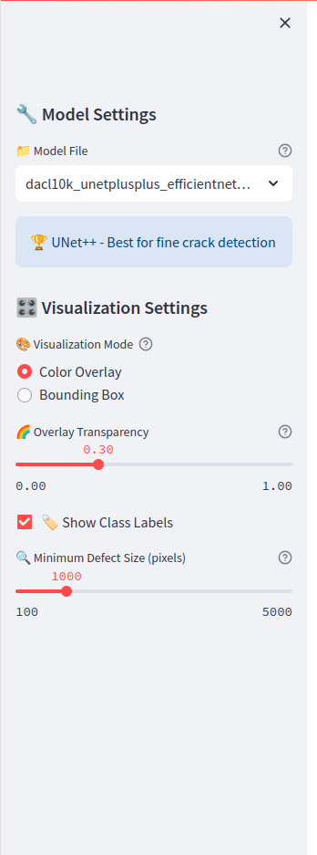
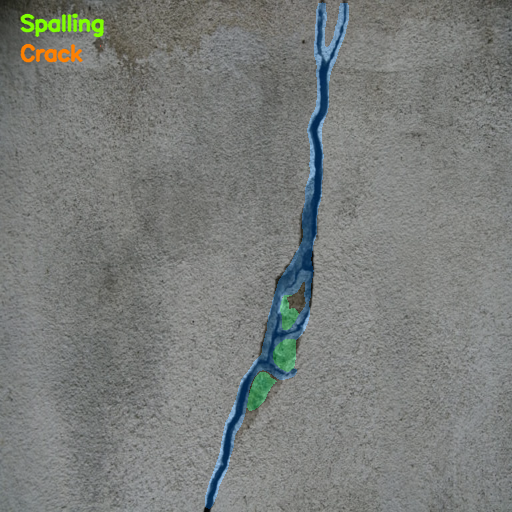
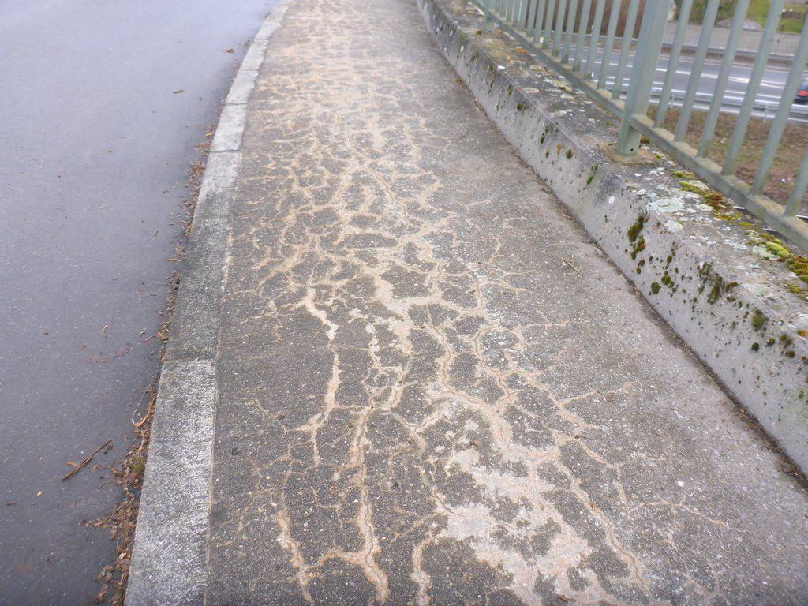

# Bridge Defect Detection System 🌉

A comprehensive deep learning solution for automated bridge infrastructure defect detection and classification using semantic segmentation. This project implements state-of-the-art computer vision models to identify and classify various types of structural defects in bridge images.

## 🔍 Overview

This system can detect and classify 11 different types of bridge defects including:
- **Rust** - Metal corrosion and oxidation
- **Alligator Crack** - Surface cracking patterns
- **Washouts/Concrete Corrosion** - Concrete deterioration
- **Cavity** - Hollow spaces and voids
- **Hollowareas** - Structural hollow regions
- **Spalling** - Surface concrete chipping
- **Rockpocket** - Aggregate exposure
- **Exposed Rebars** - Visible reinforcement bars
- **Crack** - General structural cracks
- **Weathering** - Environmental damage
- **Efflorescence** - Mineral deposits

## 🏗️ Architecture

The system is built using:
- **UNet++** with **EfficientNet-B5** encoder for optimal performance
- **Streamlit** web application for easy inference
- **Continual Learning** capabilities for model adaptation
- **PyTorch** and **Segmentation Models PyTorch** framework

## 📁 Project Structure

```
├── bridge_app.py                    # Streamlit web application
├── train_ninja.py                   # Main training script
├── continual_learning.py           # Continual learning implementation
├── image_ninja.py                  # Image processing and inference utilities
├── dacl10k_ninja_to_mask.py        # DACL10K dataset conversion
├── json_mask_min_class.py          # JSON annotation to mask converter
├── prepare_continual_dataset.py    # Dataset preparation for continual learning
└── dacl10k_unetplusplus_efficientnet_b5_ver1.pth  # Pre-trained model weights
```

## 🚀 Quick Start

### Prerequisites

```bash
pip install torch torchvision
pip install segmentation-models-pytorch
pip install streamlit
pip install opencv-python
pip install albumentations
pip install pillow numpy matplotlib tqdm
```

### Running the Web Application

```bash
streamlit run bridge_app.py
```

This will launch a web interface where you can upload bridge images and get real-time defect detection results with color-coded segmentation masks.

### Training a New Model

```bash
python train_ninja.py
```

The training script supports multiple architectures and encoders. You can modify the configuration in the script:

```python
ARCHITECTURE = 'unetplusplus'  # Options: 'deeplabv3plus', 'unetplusplus', 'fpn', 'linknet', 'pspnet'
ENCODER_NAME = 'efficientnet-b5'  # Options: 'efficientnet-b5', 'resnext101_32x8d', etc.
```

### Continual Learning

For adapting the model to new datasets or domains:

```bash
python continual_learning.py
```

This implements advanced techniques like:
- **Knowledge Distillation** - Preserves previous knowledge
- **Elastic Weight Consolidation (EWC)** - Prevents catastrophic forgetting
- **Progressive learning** - Gradually adapts to new data

## 📊 Dataset

This project uses the **DACL10K** dataset, a comprehensive collection of bridge defect images.

### DACL10K Dataset

> **Citation:**
@inproceedings{flotzinger2024dacl10k,
  title={dacl10k: benchmark for semantic bridge damage segmentation},
  author={Flotzinger, Johannes and R{\"o}sch, Philipp J and Braml, Thomas},
  booktitle={Proceedings of the IEEE/CVF Winter Conference on Applications of Computer Vision},
  pages={8626--8635},
  year={2024}
}

The DACL10K dataset contains:
- **10,000+** high-resolution bridge images
- **Pixel-level annotations** for 19 defect classes
- **Diverse conditions** including different lighting, weather, and bridge types
- **Real-world data** collected from actual bridge inspections

### DatasetNinja Integration

This project leverages **DatasetNinja** for efficient dataset management and processing.

> **DatasetNinja Citation:**
> 
> DatasetNinja. (2023). DACL10K: Damage Assessment for Civil Infrastructure using Computer Vision. Retrieved from https://datasetninja.com/dacl10k

### Data Preprocessing

The project includes utilities to convert DatasetNinja JSON annotations to training-ready segmentation masks:

```bash
# Convert DACL10K annotations
python dacl10k_ninja_to_mask.py

# Prepare datasets for continual learning
python prepare_continual_dataset.py
```

## 🎯 Model Performance

The current model achieves:
- **High accuracy** on bridge defect classification
- **Real-time inference** capability
- **Robust performance** across different bridge types and conditions
- **Memory efficient** architecture suitable for deployment

### Supported Architectures

- **UNet++** - Enhanced U-Net with dense skip connections
- **DeepLabV3+** - Atrous spatial pyramid pooling
- **FPN** - Feature Pyramid Networks
- **PSPNet** - Pyramid Scene Parsing
- **LinkNet** - Efficient encoder-decoder architecture

### Backbone Options

- **EfficientNet** (B0-B7) - Optimal efficiency/accuracy trade-off
- **ResNeXt** - Enhanced residual connections
- **SE-ResNeXt** - Squeeze-and-excitation networks

## 🔧 Features

### Web Application
- **Drag-and-drop** image upload
- **Real-time processing** and visualization
- **Color-coded defect maps** with confidence scores
- **Detailed defect statistics** and analysis

### Training Pipeline
- **Multi-GPU support** for faster training
- **Advanced data augmentation** with Albumentations
- **Mixed precision training** for memory efficiency
- **Automatic model checkpointing** and recovery

### Continual Learning
- **Domain adaptation** for new bridge types
- **Incremental learning** without forgetting
- **Knowledge preservation** techniques
- **Progressive difficulty scaling**

## 📈 Usage Examples

### Basic Inference

```python
from image_ninja import load_model, predict_image

# Load pre-trained model
model = load_model('dacl10k_unetplusplus_efficientnet_b5_ver1.pth')

# Predict on new image
result = predict_image(model, 'bridge_image.jpg')
```

### Custom Training

```python
from train_ninja import DACL10KDataset

# Create custom dataset
dataset = DACL10KDataset(
    image_dir='path/to/images',
    mask_dir='path/to/masks',
    transform=get_training_transforms()
)
```

## 🖼️ Output Examples

### Web Application Interface

The Streamlit web application provides an intuitive interface for bridge defect detection:



*The web interface features drag-and-drop image upload, real-time processing, and detailed defect visualization with color-coded segmentation maps.*

### Defect Detection Results

The system can accurately identify and segment various types of bridge defects:

#### Example 1: Concrete Cracking Detection
<p align="center">
  
  
</p>

*Left: Original bridge image showing concrete cracking. Right: AI-generated segmentation mask highlighting detected defects with color-coded classifications.*

#### Example 2: Multiple Defect Detection
.png)

*Advanced defect detection showing multiple defect types simultaneously identified and classified with high precision.*

#### Example 3: Leaching and Weathering


*Detection of leaching and weathering patterns in concrete structures, demonstrating the system's capability to identify subtle deterioration signs.*

### Key Visualization Features

- **Color-coded segmentation**: Each defect type is assigned a unique color for easy identification
- **Confidence mapping**: Visual indication of detection confidence levels
- **Multi-class detection**: Simultaneous identification of multiple defect types in a single image
- **Real-time processing**: Immediate results for uploaded images

## 🤝 Contributing

Contributions are welcome! Please feel free to submit a Pull Request. For major changes, please open an issue first to discuss what you would like to change.

## 📄 License

This project is open source and available under the [MIT License](LICENSE).

## 🙏 Acknowledgments

- **DACL10K Dataset**: Thanks to the researchers who created and maintain this comprehensive bridge defect dataset
- **DatasetNinja**: For providing excellent dataset management and access tools
- **Segmentation Models PyTorch**: For the robust segmentation model implementations
- **Streamlit**: For enabling rapid web application development

## 📞 Contact

For questions, suggestions, or collaboration opportunities, please open an issue on GitHub.

---

*This project aims to contribute to safer infrastructure through automated defect detection and assessment.*
